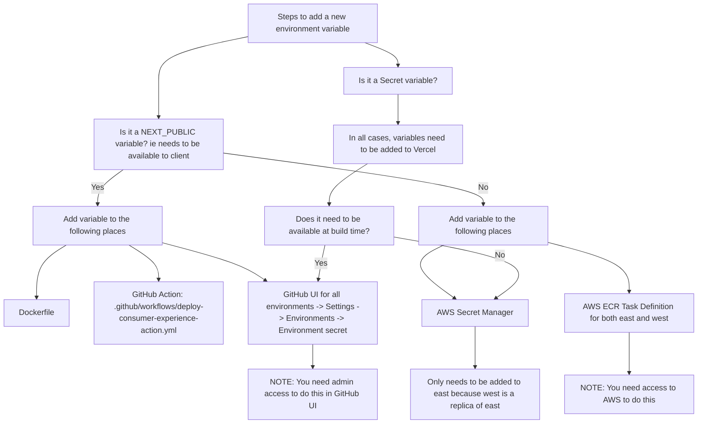

<!-- I'm not sure about this flow chart -->
<!-- - environmentd.d.ts
- turbo.json
- .env.example -->

```mermaid
graph
A[Steps to add a new environment variable] --> B[Is it a NEXT_PUBLIC variable? ie needs to be available to client]

    B -->|Yes| C[Add variable to the following places]
    C --> D[Dockerfile]
    C --> E[GitHub Action: .github/workflows/deploy-consumer-experience-action.yml]
    C --> O[GitHub UI for all environments -> Settings -> Environments]

    B -->|No| H[Add variable to the following places]
    H --> I[AWS Secret Manager]
    I --> J[Only needs to be added to east because west is a replica of east]
    H --> K[AWS ECR Task Definition for both east and west]
    K --> L[NOTE: You need access to AWS to do this]

    A --> M[Is it a Secret variable?]
    U --> N[Does it need to be available at build time?]
    N -->|Yes| O[GitHub UI for all environments -> Settings -> Environments -> Environment secret]
    O --> P[NOTE: You need admin access to do this in GitHub UI]
    N -->|No| I

    M --> U[In all cases, variables need to be added to Vercel]
```
