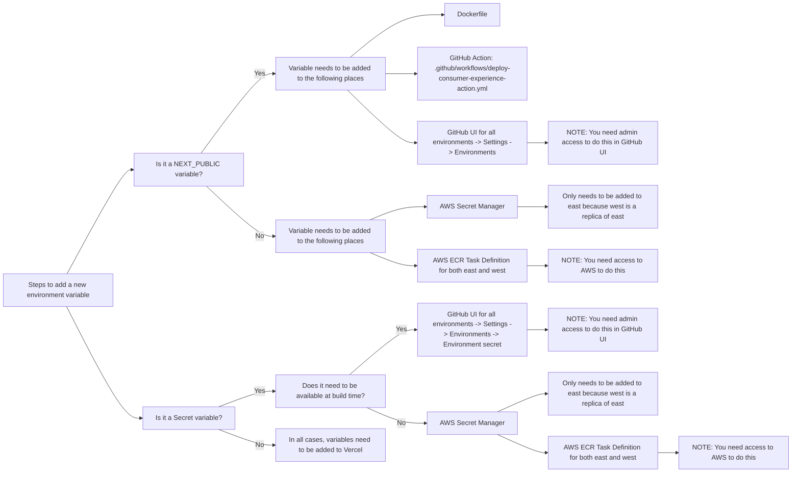

```mermaid
graph LR
A[Steps to add a new environment variable] --> B[Is it a NEXT_PUBLIC variable?]

    B -->|Yes| C[Variable needs to be added to the following places]
    C --> D[Dockerfile]
    C --> E[GitHub Action: .github/workflows/deploy-consumer-experience-action.yml]
    C --> F[GitHub UI for all environments -> Settings -> Environments]
    F --> G[NOTE: You need admin access to do this in GitHub UI]

    B -->|No| H[Variable needs to be added to the following places]
    H --> I[AWS Secret Manager]
    I --> J[Only needs to be added to east because west is a replica of east]
    H --> K[AWS ECR Task Definition for both east and west]
    K --> L[NOTE: You need access to AWS to do this]

    A --> M[Is it a Secret variable?]
    M -->|Yes| N[Does it need to be available at build time?]
    N -->|Yes| O[GitHub UI for all environments -> Settings -> Environments -> Environment secret]
    O --> P[NOTE: You need admin access to do this in GitHub UI]
    N -->|No| Q[AWS Secret Manager]
    Q --> R[Only needs to be added to east because west is a replica of east]
    Q --> S[AWS ECR Task Definition for both east and west]
    S --> T[NOTE: You need access to AWS to do this]

    M -->|No| U[In all cases, variables need to be added to Vercel]
```
