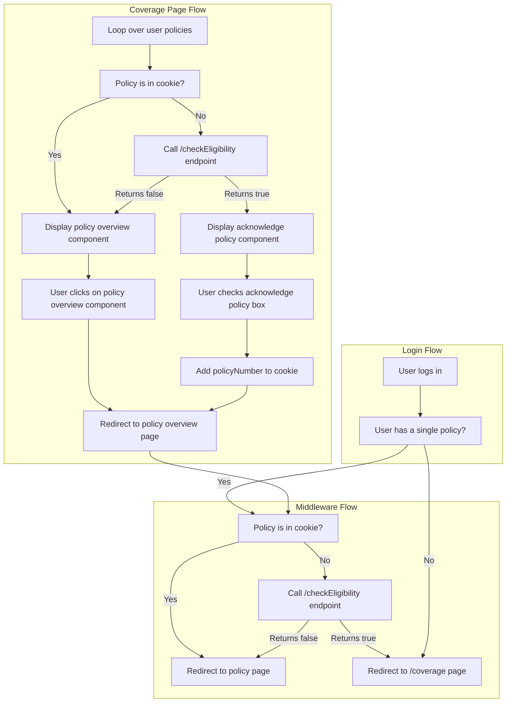

# Policy Acknowledgement

See this [doc](https://zinnia.atlassian.net/wiki/spaces/AU/pages/4728488023/Policy+Acknowledgement#User-Journey) to learn more about the policy acknowledgement flow.

From a dev perspective, the important part is that we need to verify that a user has acknowledged their policy before they view any interior pages (except for the policy document). To do this, we set a cookie on initial view and then subsequently check that cookie in middleware on each page navigation.

## To test flow

1. [Make a new policy](./MakeANewPolicy.mdx)
1. [Set delivery preference](./update-policy-delivery-preference.md)
