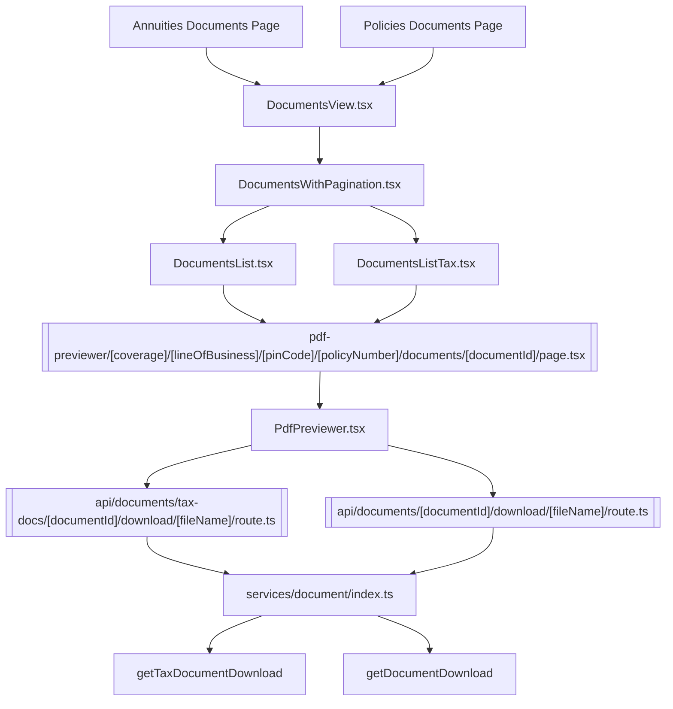

# Documents Page and Downloading a document

The tax docs vs not tax docs page/component split happens whenever the different properties between the two need to be explicitly called. For the list components, that’s for rendering. For the download routeHandlers that’s when the specific doc download is called. I separated them to try to keep the routeHandler url as close to the actual api call as possible, so that it’s clear you’re explicitly calling a certain type of doc.

